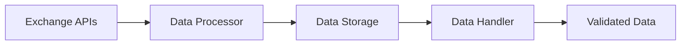

# Data Kitchen 🧪

A robust, scalable data processing pipeline for financial market data. Built with efficiency and data quality in mind.

## 🔥 Key Features

- **Modular Architecture**: Clean separation of concerns with specialized components
- **Data Quality Assurance**: Built-in validation and quality checks
- **Efficient Processing**: Smart chunking and memory management
- **Multi-Exchange Support**: Seamless integration with multiple data sources
- **Flexible Storage**: Optimized Parquet storage with efficient querying

## 🏗️ Architecture

The system follows a clear processing chain:

### 1. Data Processor (`processor.py`)
- Raw data collection from multiple exchanges
- Initial data cleaning and formatting
- Technical indicator calculations
- Memory-efficient chunked processing

### 2. Data Storage (`data_storage.py`)
- Efficient Parquet file management
- Data versioning and organization
- Optimized read/write operations
- Automatic directory structure management

### 3. Data Utils (`data_utils.py`)
- Technical indicator calculations
- Data normalization

### 4. Data Validator (`data_validator.py`)
- Data Cleaning
- NaN value detection
- Outlier detection
- Data type validation

### 5. Data Handler (`data_handler.py`)
- Single endpoint for data operations
- Advanced data validation:
  - Sequence length verification
  - Missing value detection
  - Variance analysis
- Consistent data shape management
- Quality assurance checks

## 🔄 Data Flow



## 💻 Usage

```python
from data_processor.data_handler import DataHandler

# Initialize the handler
handler = DataHandler()

# Get processed and validated data
data = handler.get_training_data(
    pairs=['BTC/USDT', 'ETH/USDT'],
    timeframes=['1h', '4h', '1d']
)
```

## ⚙️ Configuration

Key settings in `config.py`:
- Exchange API credentials
- Trading pairs and timeframes
- Technical indicators
- Data storage paths
- Processing parameters

## 🔍 Data Validation

Built-in validation checks:
- Minimum sequence length requirements
- Maximum missing value thresholds
- Variance analysis for feature quality
- Data shape consistency
- Time series continuity

## 📊 Supported Data Types

- OHLCV (Open, High, Low, Close, Volume)
- Technical indicators (RSI, MACD, etc.)
- Custom feature calculations
- Multiple timeframes support

## 🚀 Performance Optimizations

- Chunked data processing
- Memory usage monitoring
- Efficient data storage format
- Parallel processing capabilities
- Smart data caching

## 📝 Dependencies

- pandas: Data manipulation
- numpy: Numerical operations
- ccxt: Exchange API integration
- pyarrow: Parquet file handling
- rich: Progress visualization
- pytest: Automated testing
- pytest-cov: Coverage analysis
- textblob: Sentiment analysis
- beautifulsoup4: Web scraping
- requests: HTTP requests
- lxml: XML parsing

## 🛠️ Installation

```bash
git clone https://github.com/xRetr00/data-kitchen.git
cd data-kitchen
pip install -r requirements.txt
```

## 🤝 Contributing

1. Fork the repository
2. Create a feature branch
3. Commit your changes
4. Push to the branch
5. Create a Pull Request

## 📜 License

This project is licensed under the MIT License - see the LICENSE file for details.

---

## 🌟 Acknowledgements

- [ccxt](https://github.com/ccxt/ccxt)
- [pandas](https://pandas.pydata.org/)
- [numpy](https://numpy.org/)
- [pyarrow](https://arrow.apache.org/)
- [rich](https://rich.readthedocs.io/en/latest/index.html)
- [pytest](https://docs.pytest.org/en/latest/)
- [pytest-cov](https://pytest-cov.readthedocs.io/en/latest/)
- [textblob](https://textblob.readthedocs.io/en/latest/)
- [beautifulsoup4](https://www.crummy.com/software/BeautifulSoup/bs4/doc/)
- [requests](https://docs.python-requests.org/en/latest/)
- [lxml](https://lxml.de/)

## 🌟 Credits

- Built with 🧪 by [xRetr00](https://github.com/xRetr00)

---
